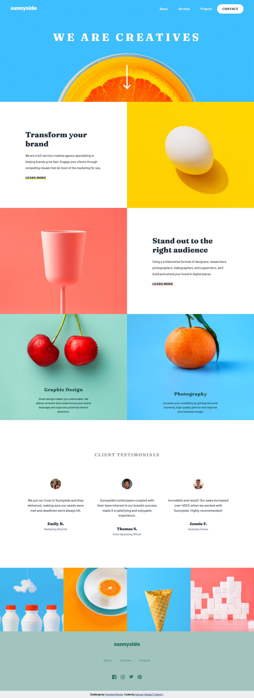
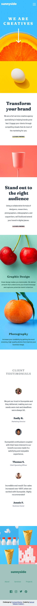

# Frontend Mentor - Sunnyside agency landing page solution

This is a solution to the [Sunnyside agency landing page challenge on Frontend Mentor](https://www.frontendmentor.io/challenges/sunnyside-agency-landing-page-7yVs3B6ef). Frontend Mentor challenges help you improve your coding skills by building realistic projects.

## Table of contents

- [Frontend Mentor - Sunnyside agency landing page solution](#frontend-mentor---sunnyside-agency-landing-page-solution)
  - [Table of contents](#table-of-contents)
  - [Overview](#overview)
    - [The challenge](#the-challenge)
    - [Screenshot](#screenshot)
    - [Links](#links)
  - [My process](#my-process)
    - [Built with](#built-with)
    - [What I Admire about this project](#what-i-admire-about-this-project)
  - [Author](#author)

**Note: Delete this note and update the table of contents based on what sections you keep.**

## Overview

### The challenge

Users should be able to:

- View the optimal layout for the site depending on their device's screen size
- See hover states for all interactive elements on the page

### Screenshot

### Links

- Solution URL: https://github.com/chiefcipher/sunnyside-agency-landing-page
- Live Site URL:https://chiefcipher.github.io/sunnyside-agency-landing-page/

## My process

### Built with

- Semantic HTML5 markup
- SCSS custom properties, utility clasess and components
- SCSS Flexbox and Grid
- CSS 
- JavaScript

### What I Admire about this project

- It component based system allowed me to think ahead of time how my code needs to be inorder to ensure i dont repeat myself
- It grid system
- Use of responsive images to ensure those on smaller screen sizes do not download unnecessary large files

## Author

- Website - [Samuel Yakubu](http://chiefcipher.netlify.app/)
- Frontend Mentor - [@chiefcipher](https://www.frontendmentor.io/profile/chiefcipher)
- Twitter - [@chief_cipher](https://twitter.com/chief_cipher)

